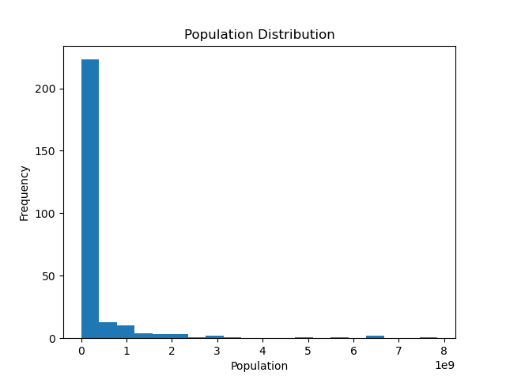
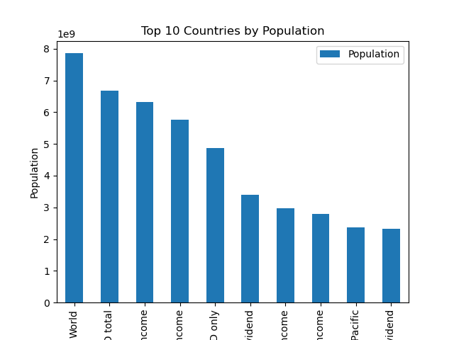

# PRODIGY_DS_01

## 📌 Internship Track
Data Science Internship at Prodigy InfoTech

---

## 📊 Task Objective
To visualize the distribution of population data using histogram and bar chart, and derive insights about global population patterns.

---

## 📁 Dataset
World Population Dataset (Provided by Prodigy InfoTech)

The dataset contains population data of countries across different years.

---

## 🧹 Data Preprocessing

- Loaded dataset using Pandas  
- Cleaned and structured the data  
- Selected relevant columns for analysis  
- Prepared data for visualization  

---

## 📈 Exploratory Data Analysis

The following visualizations were created:

- Distribution of population using histogram  
- Top 10 most populated countries using bar chart  

---

## 📊 Visualizations

### 📌 Population Distribution (Histogram)

### 🌍 Top 10 Most Populated Countries

---

## 🔍 Key Insights

- Population distribution is highly skewed, with a few countries having very large populations  
- Countries like China and India dominate global population  
- Most countries fall under lower population ranges  

---

## 🛠 Tools & Technologies

- Python  
- Pandas  
- NumPy  
- Matplotlib  
- Seaborn  

---

## 📂 Project Structure

PRODIGY_DS_01/

│

├── data/

│

├── notebooks/

│

├── outputs/

│ ├── population_histogram.png

│ └── top10_countries.png

│

└── README.md

---

## ✅ Conclusion

This project demonstrates how data visualization techniques can be used to understand population distribution and identify global demographic patterns effectively.

---

## 👤 Author
Gokul S
